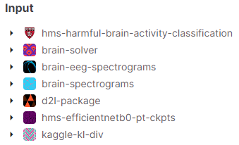

# Noodle Nappers -- MLiP Project

This is a Project Repository of Machine Learning in Practise. It contains two projects.

1. https://www.kaggle.com/competitions/hms-harmful-brain-activity-classification/discussion/468010
2.

## Project Structure

```
noodle_nappers/
|-- brain/
|   |-- brain_solver/
|   |-- requirements.txt
|   |-- main.py
|   |-- ...
|
|-- second_project_once_released/
|   |-- requirements.txt
|   |-- main.py
|   |-- ...
|
|-- docs/
|   |-- ...
```

## Version

We are using _Python 3.10_ and the requirement installed as specified always with `pip`:

```bash
python3.10 -m venv venv
source venv/bin/activate
pip install -r requirements.txt
```

## Commit and PR Rules

1. **"Protected" master branch**: Direct commits to the master branch are not recommended. The branch is not locked, but do not do it.
2. **Branching**: Always create a new branch for your changes. Name your branch based on the feature or fix you're working on, preferably linking to an issue number. E.g., `feature-12-add-new-filter` or `fix-15-resolve-this-really-stupid-bug`.
3. **Commit Messages**:
   - Commits should be categorized using prefixes like `feat:`, `fix:`, `chore:`, `docs:`, `style:`, `refactor:`, `perf:`, and `test:`.
   - Use meaningful commit messages that clearly describe the change.
   - Incorporate the GitHub issue number at the beginning, e.g., `feat(#12): Added new functionality`. (optional)
4. **Pull Requests (PRs)**:
   - Each PR must be associated with a GitHub issue.
   - PRs should have descriptive titles and should explain the purpose and content of the changes.
   - Each PR must have at least one review before merging.
   - After reviews and any necessary adjustments, the PR can be merged into the master branch.

## Template for Commit Messages

```
[prefix(#GitHub Issue Number)]: Short description of the change
[prefix]: Short description of the change

For example:
feat(#12): Add new filter functionality
feat: Add new filter functionality

(Optional) A more detailed description can follow if required. It should provide context for the change, detail on the solution, or any other pertinent information.
```

This README should give a clear overview of the project and lay down some basic rules for collaboration.

## Structure of HMS competition

- training.ipynb is the notebook for the training workflow.
- luppo_inter.ipynb is the notebook for the inference workflow.
- brain_model.py provides the validation functions for the training notebook. It's only used by the training notebook.
- config.py stores any model variables and makes sure the data paths are set up properly. It's used by the training and testing notebooks as well as by brain_model.py.
- trainer.py provides the framework for the actual training process. It is used by the training workbook to perform training and by the inference notebook to load the trained model.
- eeg_dataset.py provides a class framework for storing the data set in, so that it can be interpreted by torch's data loader. It's used by both notebooks.
- helpers.py provides a variety of helper functions (e.g. loading csv files and reading/plotting spectrograms). It is used heavily used by both notebooks.
- filter.py gives filtering functions for pre-processing (e.g. high pass + low pass), however as far as I can tell it is not yet used.
- wav2vec2.py performs the wav2vec preprocessing. It is also not yet integrated anywhere.
- setup.py makes sure all necessary packages are installed

### Required input files for HMS competition


